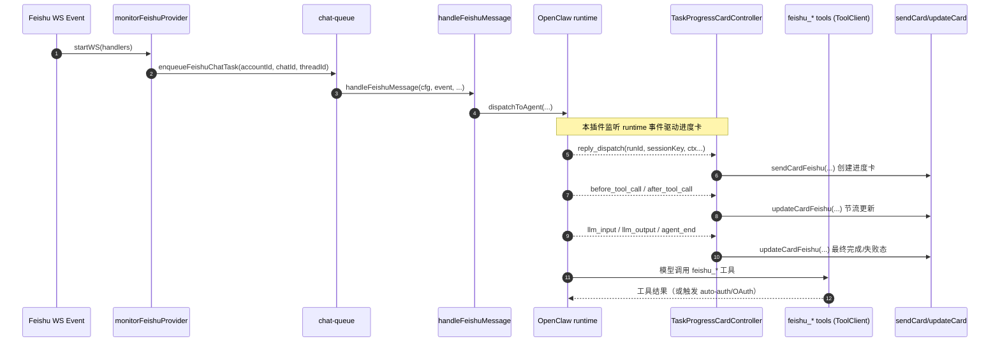
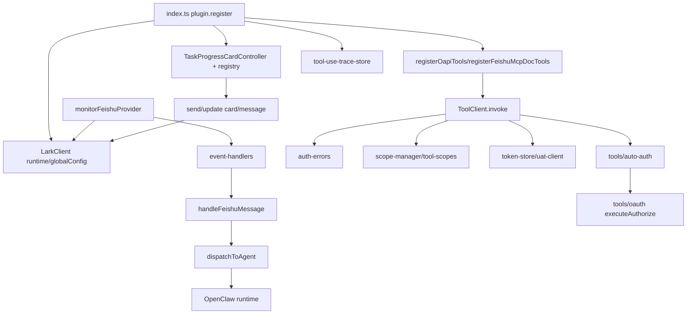

# openclaw-lark-plus Code Wiki

本仓库是 `@hehejie/openclaw-lark-plus`（OpenClaw 的 Lark/飞书增强插件）的源码。它基于官方 `@larksuite/openclaw-lark` Fork，核心增强点是：在 OpenClaw 开始处理用户消息后，立即发送一张“执行进度卡”，并在执行过程中持续对同一张卡片进行更新，展示关键节点（模型/工具/skill/错误）。

仓库地址：<https://github.com/Hehejie1/openclaw-lark-plus>

## 1. 快速结论（你需要知道的）

- 这是一个 Node.js（ESM）+ TypeScript 的 OpenClaw 插件，发布为 npm 包 `@hehejie/openclaw-lark-plus`（Node >= 22）。
- 插件入口在 [index.ts](file:///workspace/index.ts) 的默认导出 `plugin`（注册工具、命令，并监听 OpenClaw runtime 事件来驱动“进度卡”更新）[index.ts:L110-L352](file:///workspace/index.ts#L110-L352)。
- 飞书入站事件来自 WebSocket：`monitorFeishuProvider → LarkClient.startWS → event-handlers → handleFeishuMessage(...)`，并通过队列做串行化与去重 [monitor.ts](file:///workspace/src/channel/monitor.ts) / [event-handlers.ts](file:///workspace/src/channel/event-handlers.ts) / [handler.ts](file:///workspace/src/messaging/inbound/handler.ts)。
- 工具（tools）主要分两类：
  - OAPI：直接调用飞书开放平台 SDK（`@larksuiteoapi/node-sdk`）注册 `feishu_*` 工具 [oapi/index.ts](file:///workspace/src/tools/oapi/index.ts#L46-L95)。
  - MCP：以 MCP 方式提供 doc 工具（见 [src/tools/mcp/doc](file:///workspace/src/tools/mcp/doc)）。
- 授权/权限是系统设计重点：`ToolClient` 负责 UAT/TAT 选择、scope 预检与结构化错误；`auto-auth` 在工具层自动发起 OAuth/引导卡片，避免把授权决策交给 AI [tool-client.ts](file:///workspace/src/core/tool-client.ts) / [auto-auth.ts](file:///workspace/src/tools/auto-auth.ts)。

## 2. 技术栈与依赖

### 2.1 运行与构建

- Node.js：>= 22（见 [package.json](file:///workspace/package.json#L30-L32)）
- 包管理：pnpm（`packageManager: pnpm@10.x`）
- 构建：tsdown（见 [tsdown.config.ts](file:///workspace/tsdown.config.ts)）
- 测试：vitest（见 [vitest.config.ts](file:///workspace/vitest.config.ts)）
- CI：GitHub Actions（lint/format/typecheck/test）见 [ci.yml](file:///workspace/.github/workflows/ci.yml)

### 2.2 关键依赖（runtime）

来自 [package.json](file:///workspace/package.json#L51-L83)：

- `openclaw`（peer，可选但要求版本 `>=2026.3.22`）：插件运行宿主（OpenClaw Gateway、plugin-sdk、runtime 事件、tool 注册等）。
- `@larksuiteoapi/node-sdk`：飞书/Lark Open API SDK（HTTP + WebSocket）。
- `zod`：配置与数据校验（例如飞书渠道配置 schema）[config-schema.ts](file:///workspace/src/core/config-schema.ts)。
- `@sinclair/typebox`：工具参数 schema（用于 OpenClaw tool 注册）[oauth.ts](file:///workspace/src/tools/oauth.ts#L19-L66)。
- `image-size`：媒体/图片尺寸解析（用于卡片/媒体处理相关逻辑）。

## 3. 仓库目录结构（按职责）

```
.
├─ index.ts                      # 插件入口：注册工具/命令/进度卡钩子
├─ openclaw.plugin.json          # 插件元信息：id、channels、skills、tool contracts
├─ src/
│  ├─ channel/                   # 飞书渠道：WS 监控、事件路由、队列/交互分发
│  ├─ messaging/                 # 消息：Inbound 解析/门禁/分发；Outbound 发送/更新/媒体
│  ├─ tools/                     # Tools：OAPI 工具、OAuth、auto-auth、AskUserQuestion 等
│  ├─ card/                      # 卡片：进度卡、流式卡、trace 展示、节流更新
│  ├─ core/                      # 核心：LarkClient、ToolClient、auth/scope、token/store、配置等
│  └─ commands/                  # Chat 命令与 CLI 命令（诊断/doctor/auth 等）
├─ skills/                       # OpenClaw skills 文档/指南（SKILL.md）
├─ bin/                          # CLI 包装器（调用官方 openclaw-lark-tools、发版脚本入口）
├─ scripts/                      # 发布脚本（npm + GitHub release）
└─ tests/                        # vitest 测试
```

## 4. 整体架构

### 4.1 核心目标与设计分层

- **Channel/Monitor 层**：负责连接飞书 WebSocket，接收事件并路由到处理器（消息、reaction、bot 成员变化、评论、卡片 action 等）。
- **Messaging 层**：将“事件”变成 OpenClaw 可理解的 `MessageContext`，做策略门禁（mention/allowlist/反 bot 自激等），再分发给 OpenClaw Agent 进行推理/执行；并提供 Outbound 能力（发消息、发卡片、更新卡片、发送媒体等）。
- **Tools 层**：把飞书各类 API（IM/Docs/Drive/Bitable/Calendar/Task/Wiki/Sheets...）以 OpenClaw 工具形式暴露给模型，同时在工具层做权限与授权流程的“强一致处理”。
- **Card 层（本仓库的增强重点）**：独立于最终回复卡的“执行进度卡”控制器，负责“立即响应 + 持续更新 + 节流 patch”，并可记录工具调用 trace。
- **Core 层**：提供 Lark SDK 客户端管理、token/scope/授权错误模型、配置 schema、缓存与日志等通用能力。

### 4.2 关键执行链路（消息到回复）

下图强调“入站事件 → OpenClaw dispatch → 进度卡更新”的主路径：



## 5. 主要模块与职责（含关键类/函数）

### 5.1 插件入口：index.ts

入口文件：[index.ts](file:///workspace/index.ts)

- `plugin.register(api)`：插件初始化主入口 [index.ts:L115-L349](file:///workspace/index.ts#L115-L349)
  - 注册工具：`registerOapiTools` / `registerFeishuMcpDocTools` / OAuth / AskUserQuestion [index.ts:L123-L137](file:///workspace/index.ts#L123-L137)
  - 注册诊断 CLI：`openclaw feishu-diagnose` [index.ts:L304-L340](file:///workspace/index.ts#L304-L340)
  - 注册聊天命令：`registerCommands(api)`（/feishu_*）[index.ts:L342-L344](file:///workspace/index.ts#L342-L344)
  - 监听 runtime 事件并驱动进度卡：
    - `reply_dispatch`：创建并绑定进度卡（若尚未存在）[index.ts:L138-L200](file:///workspace/index.ts#L138-L200)
    - `before_tool_call` / `after_tool_call`：更新“工具节点”，并记录 tool-use trace [index.ts:L219-L275](file:///workspace/index.ts#L219-L275)
    - `llm_input` / `llm_output`：更新“模型节点”[index.ts:L277-L285](file:///workspace/index.ts#L277-L285)
    - `agent_end`：完成/失败收尾并释放 registry [index.ts:L202-L217](file:///workspace/index.ts#L202-L217)

补充：`resolveReplyInThread(...)` 用于确定是否以 thread 方式回复 [index.ts:L354-L361](file:///workspace/index.ts#L354-L361)。

### 5.2 Channel / Monitor：飞书 WebSocket 入站网关

核心文件：

- `monitorFeishuProvider(opts)`：启动单账号或多账号 WS 监听 [monitor.ts:L134-L182](file:///workspace/src/channel/monitor.ts#L134-L182)
- `monitorSingleAccount(...)`：为账号创建 `LarkClient`，装配 `MessageDedup`，注册 SDK handlers 并 `startWS` [monitor.ts:L45-L124](file:///workspace/src/channel/monitor.ts#L45-L124)
- `handleMessageEvent(...)`：消息事件处理（去重、过期丢弃、abort 快路径、入队、withTicket 绑定上下文后调用 `handleFeishuMessage`）[event-handlers.ts:L71-L167](file:///workspace/src/channel/event-handlers.ts#L71-L167)

队列化（串行化）设计要点：

- 通过 `chat-queue` 以 `(accountId, chatId, threadId)` 维度构造队列 key，避免同一会话内并发导致上下文混乱，同时允许不同会话并行处理（见 [event-handlers.ts](file:///workspace/src/channel/event-handlers.ts) 中对 `enqueueFeishuChatTask` 的使用）。
- “Abort 快路径”：在消息进入队列前检测文本是否像“停止/abort”，若当前会话存在 active dispatcher，则直接 abort streaming card [event-handlers.ts:L112-L130](file:///workspace/src/channel/event-handlers.ts#L112-L130)。

### 5.3 Messaging Inbound：消息处理流水线（7+ 阶段）

入口：[handleFeishuMessage](file:///workspace/src/messaging/inbound/handler.ts#L50-L228)

处理阶段（源码注释里明确写为 1~7）[handler.ts:L7-L15](file:///workspace/src/messaging/inbound/handler.ts#L7-L15)：

1. **Account resolution**：从全局 cfg 解析出 account 配置
2. **Parse**：`parseMessageEvent(...)` 把事件解析为 `MessageContext`
3. **Enrich（轻量）**：补齐 sender 信息、权限错误跟踪 `resolveSenderInfo(...)`
4. **Gate（门禁）**：`checkMessageGate(...)` 做策略/安全检查（群聊 requireMention、allowFrom、allowBots 等）
5. **Prefetch**：批量预热用户名缓存 `prefetchUserNames(...)`
6. **Enrich（重）**：并行解析媒体与引用内容 `resolveMedia + resolveQuotedContent(...)`
7. **Dispatch**：计算 `commandAuthorized` 后 `dispatchToAgent(...)` 进入 OpenClaw 推理/执行

多账号隔离点：

- `accountScopedCfg`：把 `cfg.channels.feishu` 替换为“当前账号合并配置”，确保下游 SDK/门禁读取的是 per-account 配置 [handler.ts:L74-L88](file:///workspace/src/messaging/inbound/handler.ts#L74-L88)。

### 5.4 Dispatch Context：路由、线程会话、系统事件

核心文件：[dispatch-context.ts](file:///workspace/src/messaging/inbound/dispatch-context.ts)

- `buildDispatchContext(...)`：构造后续 dispatch 所需的统一上下文（route/sessionKey、envelopeFrom、isGroup/isThread、system event）[dispatch-context.ts:L72-L155](file:///workspace/src/messaging/inbound/dispatch-context.ts#L72-L155)
- `resolveThreadSessionKey(...)`：在支持 thread 的群里，把 sessionKey 细化到 thread 维度（需 `threadSession=true` 且群组类型支持 thread）[dispatch-context.ts:L172-L201](file:///workspace/src/messaging/inbound/dispatch-context.ts#L172-L201)

### 5.5 Messaging Outbound：发消息/发卡/更新卡

核心文件：[send.ts](file:///workspace/src/messaging/outbound/send.ts)

关键函数：

- `sendMessageFeishu(params)`：发送 Feishu “post” 消息（支持 markdown、表格转换、mentions、i18nTexts、replyInThread）[send.ts:L109-L211](file:///workspace/src/messaging/outbound/send.ts#L109-L211)
- `sendCardFeishu(params)`：发送 interactive card（用于进度卡、授权卡等）[send.ts:L223-L240](file:///workspace/src/messaging/outbound/send.ts#L223-L240)
- `updateCardFeishu(...) / editMessageFeishu(...)`：用于对已发送消息进行 patch/update（同文件后半段）

表格渲染设计：

- `convertMarkdownTablesForFeishu(...)` 会尝试从 OpenClaw runtime 获取表格转换器；不可用时保持原样 [send.ts:L76-L92](file:///workspace/src/messaging/outbound/send.ts#L76-L92)。

### 5.6 Card：进度卡与节流更新（本仓库核心增强）

核心文件：

- `TaskProgressCardController`：[task-progress-controller.ts](file:///workspace/src/card/task-progress-controller.ts#L43-L244)
  - `ensureCardCreated()`：首次创建进度卡（调用 `sendCardFeishu`）[task-progress-controller.ts:L71-L89](file:///workspace/src/card/task-progress-controller.ts#L71-L89)
  - `setExecution(...)`：更新执行阶段（received/analyzing/planning/executing/…）[task-progress-controller.ts:L95-L106](file:///workspace/src/card/task-progress-controller.ts#L95-L106)
  - `handleToolStart/handleToolFinish`：把 tool 调用映射为进度节点 [task-progress-controller.ts:L113-L151](file:///workspace/src/card/task-progress-controller.ts#L113-L151)
  - `handleModelCall/handleModelReply`：把模型调用映射为进度节点 [task-progress-controller.ts:L153-L165](file:///workspace/src/card/task-progress-controller.ts#L153-L165)
  - `markCompleted/markFailed/abort`：最终态与 flush 收尾 [task-progress-controller.ts:L176-L214](file:///workspace/src/card/task-progress-controller.ts#L176-L214)
- `buildTaskProgressCard(state)`：把进度状态渲染为 Feishu card JSON [task-progress-builder.ts](file:///workspace/src/card/task-progress-builder.ts#L72-L202)
- `FlushController`：通用节流 flush 原语（无业务逻辑），用于卡片 patch 防抖/互斥/重刷 [flush-controller.ts](file:///workspace/src/card/flush-controller.ts#L18-L139)
- 进度卡 registry：`registerProgressController/bindProgressRun/getProgressController/unregisterProgressController` [task-progress-registry.ts](file:///workspace/src/card/task-progress-registry.ts#L14-L57)

工具 trace（用于“可观测的工具执行链路”）：

- `recordToolUseStart/recordToolUseEnd/getToolUseTraceSteps` 维护按 sessionKey 的 trace steps [tool-use-trace-store.ts](file:///workspace/src/card/tool-use-trace-store.ts#L67-L180)
- trace 内部做了敏感字段脱敏与截断，避免泄露或卡片过载（同文件 `sanitizeTraceValue`）。

### 5.7 Tools：工具注册、统一调用、授权与 scope

#### 5.7.1 OAPI 工具注册

入口：[registerOapiTools](file:///workspace/src/tools/oapi/index.ts#L46-L95)

- 把各业务域工具注册到 OpenClaw：
  - Chat / IM（user/bot）/ Calendar / Task / Bitable / Search / Drive / Wiki / Sheets 等
- 命名形态大多为 `feishu_<domain>_<resource>`，并在 [openclaw.plugin.json](file:///workspace/openclaw.plugin.json#L14-L55) 中以 contracts.tools 形式声明。

#### 5.7.2 ToolClient：工具调用统一入口（UAT/TAT + scope）

核心文件：[ToolClient](file:///workspace/src/core/tool-client.ts#L112-L220)

- `createToolClient(config)`（同文件后半段）：基于当前消息 ticket / account 解析用户身份与 SDK
- `ToolClient.invoke(toolAction, fn, options)`：工具调用的统一入口，自动处理：
  - token 类型选择：user(UAT) / tenant(TAT)
  - 应用/用户 scope 检查与结构化错误（`AppScopeMissingError` / `UserAuthRequiredError` / `UserScopeInsufficientError`）[auth-errors.ts](file:///workspace/src/core/auth-errors.ts#L121-L205)
  - UAT refresh + retry（通过 `callWithUAT`）

兼容性保护：

- ToolClient 在调用前会检查旧版 feishu 插件是否禁用，避免“重复发卡/双渠道冲突”，并给出明确命令提示 [tool-client.ts:L184-L194](file:///workspace/src/core/tool-client.ts#L184-L194)。

#### 5.7.3 Scope 管理

- `TOOL_SCOPES`：手工维护的“工具动作 → scopes”映射（见 [scope-manager.ts](file:///workspace/src/core/scope-manager.ts#L42-L91) 的说明与 `tool-scopes.ts` 数据源）。
- `getRequiredScopes(toolAction)`：查询某个工具动作所需 scopes [scope-manager.ts:L63-L65](file:///workspace/src/core/scope-manager.ts#L63-L65)

#### 5.7.4 auto-auth：工具层自动授权（关键安全设计）

核心文件：[auto-auth.ts](file:///workspace/src/tools/auto-auth.ts)

设计目的：

- 当工具遇到授权/权限问题时，**在工具层统一处理**：发卡、引导、触发 OAuth（Device Flow），避免把授权逻辑交给 AI 判断 [auto-auth.ts:L7-L30](file:///workspace/src/tools/auto-auth.ts#L7-L30)。

关键机制：

- `enqueueAuthRequest(...)`：两阶段（collecting/executing）的防抖合并与 scope 合并，避免并发工具调用导致重复授权卡片 [auto-auth.ts:L131-L245](file:///workspace/src/tools/auto-auth.ts#L131-L245)。

#### 5.7.5 OAuth 工具（撤销授权）与共享授权逻辑

核心文件：[oauth.ts](file:///workspace/src/tools/oauth.ts)

- 对外注册的 `feishu_oauth` 工具目前只暴露 `revoke`（撤销当前用户授权），并明确禁止用它来“重新授权”（重新授权由 auto-auth 自动处理）[oauth.ts:L46-L63](file:///workspace/src/tools/oauth.ts#L46-L63)。
- `executeAuthorize(...)` 为共享的 Device Flow 授权逻辑（被 auto-auth / batch-auth / onboarding 复用）[oauth.ts:L238-L260](file:///workspace/src/tools/oauth.ts#L238-L260)。

### 5.8 Core：LarkClient（SDK/WS/缓存/运行时注入）

核心文件：[lark-client.ts](file:///workspace/src/core/lark-client.ts)

- `LarkClient.setRuntime(api.runtime)`：在插件 register 阶段注入 OpenClaw runtime，供其他模块访问 [lark-client.ts:L135-L143](file:///workspace/src/core/lark-client.ts#L135-L143)
- `LarkClient.fromCfg/fromAccount/fromCredentials`：按账号缓存/创建 SDK 客户端实例，并在凭证变化时自动 dispose stale instance [lark-client.ts:L177-L224](file:///workspace/src/core/lark-client.ts#L177-L224)
- 全局 User-Agent 注入：通过 SDK interceptor 为所有请求加 `User-Agent` [lark-client.ts:L35-L55](file:///workspace/src/core/lark-client.ts#L35-L55)
- `setGlobalConfig(...)`：用于诊断/doctor 等跨账号能力读取原始全局配置 [lark-client.ts:L152-L162](file:///workspace/src/core/lark-client.ts#L152-L162)

### 5.9 Commands：诊断与用户可见的运维入口

命令聚合：[commands/index.ts](file:///workspace/src/commands/index.ts#L169-L187)

- Chat commands：
  - `/feishu start`：校验基础配置与冲突（含“旧版插件未禁用”提示）[commands/index.ts:L95-L128](file:///workspace/src/commands/index.ts#L95-L128)
  - `/feishu_diagnose`：运行诊断并输出报告 [commands/index.ts:L169-L186](file:///workspace/src/commands/index.ts#L169-L186)
  - `/feishu_doctor` / `/feishu_auth` / `/feishu help` 等（同文件后续）
- CLI：
  - `openclaw feishu-diagnose [--trace <messageId>] [--analyze]`：用于终端诊断与链路追踪 [index.ts:L304-L340](file:///workspace/index.ts#L304-L340)
  - `diagnose.ts`：诊断报告的采集与格式化（环境信息、账号状态、app scopes、日志错误等）[diagnose.ts](file:///workspace/src/commands/diagnose.ts#L64-L77)

## 6. 配置与插件元信息

### 6.1 插件元信息（OpenClaw plugin manifest）

文件：[openclaw.plugin.json](file:///workspace/openclaw.plugin.json)

- `id`: `openclaw-lark-plus`
- `channels`: `["feishu"]`
- `skills`: `["./skills"]`（skills 文档与指导）
- `contracts.tools`: 列出本插件声明的工具集合（`feishu_*`）[openclaw.plugin.json:L14-L55](file:///workspace/openclaw.plugin.json#L14-L55)

### 6.2 飞书渠道配置 Schema（Zod → JSON Schema）

文件：[config-schema.ts](file:///workspace/src/core/config-schema.ts)

- `FeishuAccountConfigSchema`：单账号配置结构（appId/appSecret、策略、groups、dedup、replyMode、threadSession、uat 等）[config-schema.ts:L157-L201](file:///workspace/src/core/config-schema.ts#L157-L201)
- `FeishuConfigSchema`：在 account 配置基础上增加 `accounts` map（多账号）[config-schema.ts:L207-L223](file:///workspace/src/core/config-schema.ts#L207-L223)
- `FEISHU_CONFIG_JSON_SCHEMA`：自动生成供插件系统消费的 JSON Schema [config-schema.ts:L236-L240](file:///workspace/src/core/config-schema.ts#L236-L240)

一个最小化“示意”配置（仅表达结构，勿复制粘贴真实 secret）：

```yaml
channels:
  feishu:
    appId: "cli_xxx"
    appSecret: "xxxxx"
    brand: "feishu"         # 或 lark / 自定义 https 域名
    connectionMode: "websocket"
    dmPolicy: "pairing"
    allowFrom: ["ou_owner_open_id"]
    groupPolicy: "allowlist"
    requireMention: true
    dedup:
      ttlMs: 43200000
      maxEntries: 5000
    threadSession: true
    accounts:
      prod:
        appId: "cli_prod"
        appSecret: "xxxxx"
      boe:
        appId: "cli_boe"
        appSecret: "xxxxx"
```

## 7. Skills（面向使用者/模型的“工具使用指南”）

`skills/` 目录包含多个 `SKILL.md`，它们不是运行时代码，而是 OpenClaw 的“技能说明文档/提示模板”，用于指导模型在特定意图下如何调用工具、注意参数约束、常见错误等。

示例：

- IM 读取：[/skills/feishu-im-read/SKILL.md](file:///workspace/skills/feishu-im-read/SKILL.md)
- Task：[/skills/feishu-task/SKILL.md](file:///workspace/skills/feishu-task/SKILL.md)
- Bitable：[/skills/feishu-bitable/SKILL.md](file:///workspace/skills/feishu-bitable/SKILL.md)

## 8. 依赖关系（内部模块图）

下面的图强调“核心单例（LarkClient/runtime）+ 工具调用（ToolClient）+ 授权（auto-auth）+ 卡片（Card）”之间的主要依赖方向：



## 9. 如何运行、开发、测试与发布

### 9.1 本地开发（仓库内）

```bash
corepack enable
pnpm install --frozen-lockfile
pnpm build
pnpm test
pnpm lint
pnpm typecheck
```

### 9.2 安装到 OpenClaw（用户侧）

来自 [README.zh.md](file:///workspace/README.zh.md#L13-L25)：

```bash
openclaw plugins install @hehejie/openclaw-lark-plus
openclaw gateway restart
```

调试安装（软链接方式）：

- `npm run dev:link` 会执行 `openclaw plugins install --link --dangerously-force-unsafe-install .`（见 [package.json](file:///workspace/package.json#L33-L37)）。

### 9.3 诊断与排障

- CLI：`openclaw feishu-diagnose`（或加 `--trace <messageId>`）[index.ts:L304-L340](file:///workspace/index.ts#L304-L340)
- Chat：`/feishu_diagnose`、`/feishu_doctor`、`/feishu_auth`、`/feishu help`（见 [commands/index.ts](file:///workspace/src/commands/index.ts)）

### 9.4 发布（维护者）

仓库提供了发版脚本：

- `bin/openclaw-lark-plus-release.js`：转发到 `scripts/publish-helper.mjs` [openclaw-lark-plus-release.js](file:///workspace/bin/openclaw-lark-plus-release.js)
- `scripts/publish-helper.mjs`：封装 npm publish 与 GitHub release（支持 fork repo、tag、gh cli 登录检查等）[publish-helper.mjs](file:///workspace/scripts/publish-helper.mjs#L17-L77)

## 10. 推荐阅读顺序（从入门到深入）

1. [README.zh.md](file:///workspace/README.zh.md)（使用方式与定位）
2. [index.ts](file:///workspace/index.ts)（插件如何注册工具/命令、如何监听 runtime 驱动进度卡）
3. [task-progress-controller.ts](file:///workspace/src/card/task-progress-controller.ts) + [task-progress-builder.ts](file:///workspace/src/card/task-progress-builder.ts)（进度卡的状态机与渲染）
4. [monitor.ts](file:///workspace/src/channel/monitor.ts) + [event-handlers.ts](file:///workspace/src/channel/event-handlers.ts)（WS 事件如何进入系统）
5. [handler.ts](file:///workspace/src/messaging/inbound/handler.ts)（Inbound 7 阶段流水线）
6. [tool-client.ts](file:///workspace/src/core/tool-client.ts) + [auto-auth.ts](file:///workspace/src/tools/auto-auth.ts)（工具调用与授权的核心逻辑）

